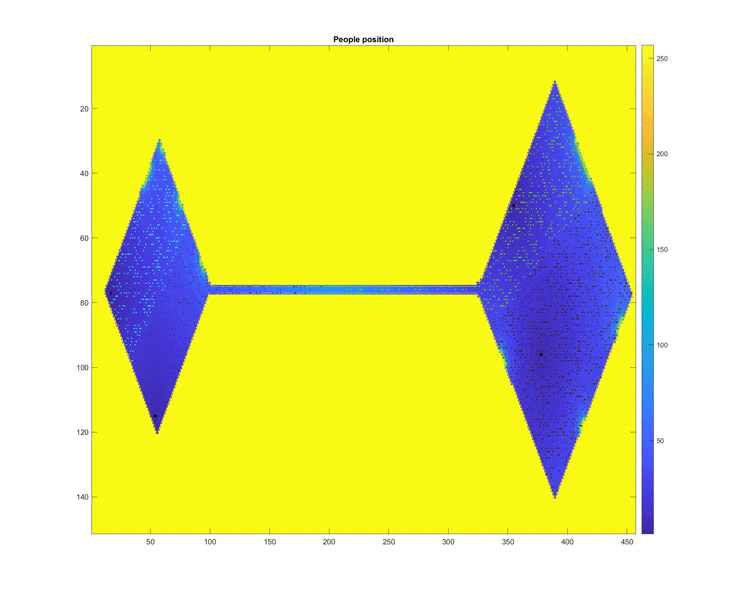
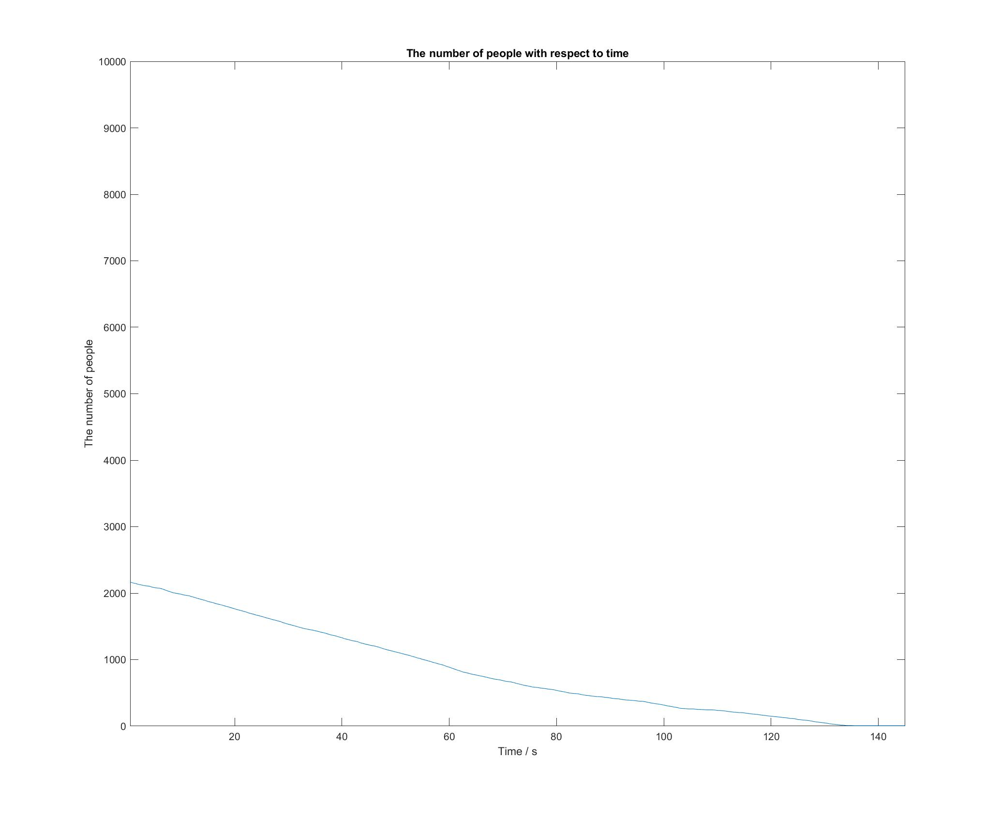

# Pedestrian_Simulation
MATLAB version: 2019b
## PSO-CA model
This project was finished (not completely) in January 2019. Particle swarm optimization (PSO) and celluler automation (CA) theorem were applied to simulate the pedestrian behavior in the Louvre when evacuation.

## How to start
 1. Go to folder "codes_MATLAB"
 2. Open "level_b2_added_gate.m" in MATLAB
 3. Change the file directory, in "level_b2_added_gate.m" and "generate_figure_contain_heat.m"
 4. Run "level_b2_added_gate.m"

## Results
### Animation of the ecavuating pedestrian

### Remained population v.s. time

